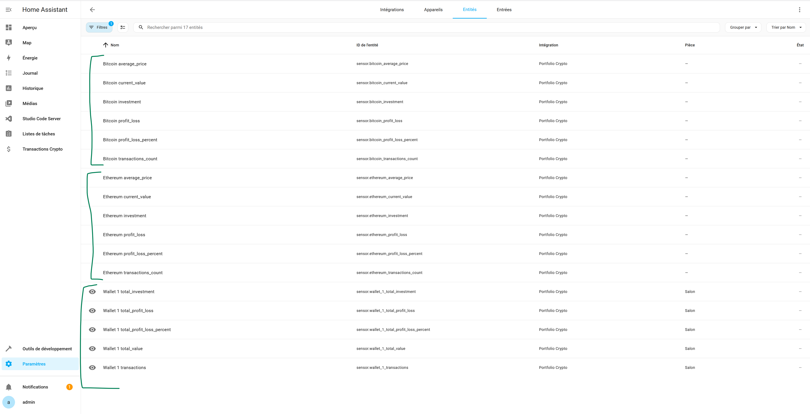
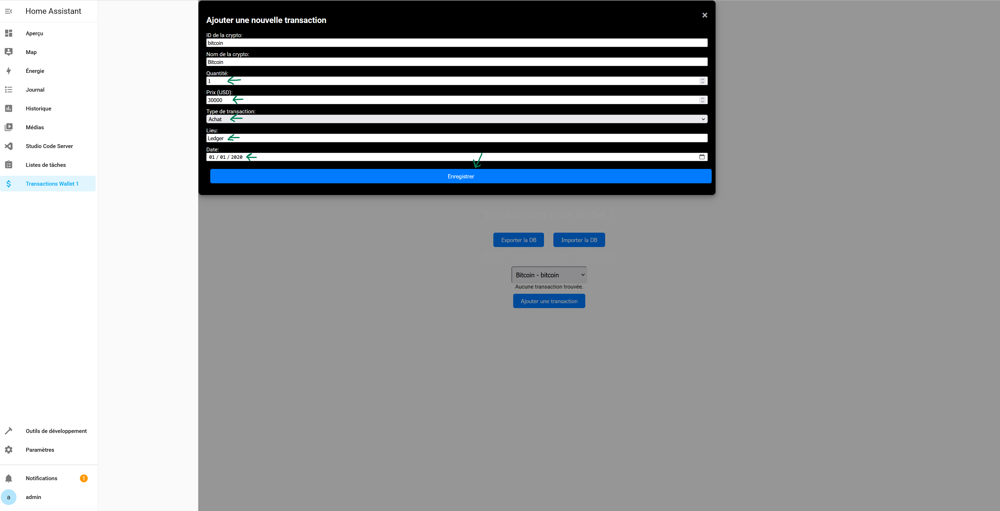

# Portfolio Crypto

## Introduction

L'intégration "Portfolio Crypto" permet de gérer et surveiller vos investissements en cryptomonnaie directement depuis Home Assistant. Cette intégration utilise l'API CoinGecko pour récupérer les informations sur les cryptomonnaies et fournit une interface simple pour suivre vos investissements.

## Fonctionnalités

- **Gestion des Portfolios** : Suivez plusieurs portfolios de cryptomonnaies.
- **Ajout/Suppression de Cryptomonnaies** : Ajoutez ou supprimez des cryptomonnaies de votre portfolio.
- **Suivi des Transactions** : Enregistrez et suivez vos transactions d'achat et de vente.
- **Calcul des Profits et Pertes** : Calculez automatiquement vos profits et pertes pour chaque cryptomonnaie.
- **Icônes Personnalisées** : Affichez des icônes uniformes pour toutes les cryptomonnaies.

## Installation

### Pré-requis

- Home Assistant installé et configuré
- Accès à l'interface de Home Assistant

### Étapes d'installation Addon

1. Accédez à votre interface Home Assistant.
2. Cliquez sur `Paramètres` dans le menu de gauche.
3. Sélectionnez `Modules complémentaires` puis cliquez sur `Boutique des modules complémentaires` et cliquez sur l'icone avec les 3 point en haut à droite, puis cliquez sur `Dépots`.
   
3. Ajoutez l'adresse :  `https://github.com/telecom4all/Portfolio-Crypto` et cliquez sur `Ajouter`.
      
4. Rafraîchissez le cache du navigateur `CTRL-F5`.
5. Recherchez `Portfolio Crypto` et cliquez sur `Installer`.
   
   
6. Démarez `Portfolio Crypto` et cliquez sur `Chien de Garde`.
   
7. Aller dans  `Journal`, actualisez jusqu'au moment ou vous verrez `Insatallation est terminée ...` 
   
8. Redémarrez `Homeassisant`
   


### Étapes d'installation Intégration

1. Accédez à `Paramètres` - `Appareils et Services`.
   
2. Cliquez sur `Ajouter une intégration` et recherchez `Portfolio Crypto` cliquez dessus pour l'installer.
   
3. Donner un nom a votre `Portefeuille` 
   
4. Vous verrez l'intégration `Portfolio Crypto` la liste et un nouveau panel dans la sidebar
   


## Configuration
### Ajouter une Cryptomonnaie

1. Une Fois dans votre `Portefeuille` cliquer sur `configurer` pour ajouter une `crypto`
   

2. Rentrez `l'id coingecko` ou le `nom de la crypto` que vous voulez ajouter puis  `Portefeuille` cliquer sur `Valider` pour rechercher le bon id sur coingecko
   

3. Vérifiez que le `nom` et l'`id` a bien été trouvé et cliquez sur `valider` pour ajouter la crypto
   

4. cliquez sur l'icone avec les 3 point du `portefeuille` pour recharger l'intégration (a faire a chaque fois que l'on ajoute une crypto)
   

5. Vous pourrez voir les `entités` qui on été crée
   

6. Vous pourrez voir les `appareils` qui on été crée
   

### Configurer le panel de la sidebar

1. Retournez dans `Paramètres` - `Modules complémentaires`
   

2. Cliquez sur l'addon `Portfolio Crypto`
   

3. Recherchez l'`entry id` de votre db 
   

4. Modifier votre `configuration.yaml`, un bout de code a été ajouter 
    modifiez `sidebar_title`, `entry_id` et `entry_name` selon votre configuration :

    ```yaml
    panel_custom:
        - name: crypto-transactions-panel
            sidebar_title: 'Transactions Wallet 1' #Nom affiché sur la sidebar
            sidebar_icon: 'mdi:currency-usd' #icone de la sidebar
            js_url: '/local/crypto-transactions-panel.js'
            config:
            entry_id: 11111111111111111111111111  # entry_id de votre db
            entry_name: "Wallet 1" # nom du portefeuille 
    ```
   
    
    Vous pouvez ajoutez autant de panel que de portefeuille crypto que vous créez en rajoutant cette partie 

    ```yaml
    panel_custom:
        - name: crypto-transactions-panel
            sidebar_title: 'Transactions Wallet 1' #Nom affiché sur la sidebar
            sidebar_icon: 'mdi:currency-usd' #icone de la sidebar
            js_url: '/local/crypto-transactions-panel.js'
            config:
            entry_id: 11111111111111111111111111  # entry_id de votre db
            entry_name: "Wallet 1" # nom du portefeuille 
    ```

    ce qui donnerai 

    ```yaml
    panel_custom:
        - name: crypto-transactions-panel
            sidebar_title: 'Transactions Wallet 1' #Nom affiché sur la sidebar
            sidebar_icon: 'mdi:currency-usd' #icone de la sidebar
            js_url: '/local/crypto-transactions-panel.js'
            config:
            entry_id: 11111111111111111111111111  # entry_id de votre db
            entry_name: "Wallet 1" # nom du portefeuille 
        - name: crypto-transactions-panel
            sidebar_title: 'Transactions Wallet 2' #Nom affiché sur la sidebar
            sidebar_icon: 'mdi:currency-usd' #icone de la sidebar
            js_url: '/local/crypto-transactions-panel.js'
            config:
            entry_id: 24157454865546546544564654  # entry_id de votre db
            entry_name: "Wallet 2" # nom du portefeuille 
    ```

5. Redémarez `homeassistant` pour prendre en compte les modification 
   


## Utilisation

### Suivi des Transactions

L'intégration "Portfolio Crypto" permet de suivre toutes vos transactions d'achat et de vente pour chaque cryptomonnaie.

- **Ajouter une Transaction** :

    Utilisez le panneau personnalisé pour ajouter une nouvelle transaction. Vous devrez fournir les informations suivantes :
    - ID de la cryptomonnaie
    - Nom de la cryptomonnaie
    - Quantité
    - Prix (USD)
    - Type de transaction (achat ou vente)
    - Lieu
    - Date

    
    
    

- **Modifier une Transaction** :

    Sélectionnez une transaction existante et modifiez les informations selon vos besoins.

- **Supprimer une Transaction** :

    Supprimez une transaction en utilisant le panneau personnalisé.

- **Exportez votre fichier de base de donnée sql** :

    Cliquez sur le boutton `Exporter Db` cela téléchargera cotre db sur votre ordinateur.
    

- **Importez votre fichier de base de donnée sql** :

    Cliquez sur le boutton `Importer Db` et aller chercher votre fichier sur l'ordinateur.
    

### Calcul des Profits et Pertes

L'intégration calcule automatiquement vos profits et pertes basés sur les transactions enregistrées. 

Les informations suivantes sont disponibles pour le portefeuille:
- Investissement Total
- Valeur Actuelle
- Profit/Perte Total
- Pourcentage de Profit/Perte
- Nombre de transactions

Les informations suivantes sont disponibles pour le portefeuille:
- Investissement Total
- Valeur Actuelle
- Profit/Perte Total
- Pourcentage de Profit/Perte
- Nombre de transactions
- prix d'achat moyen


## Dépannage

### Problèmes de Connexion

Si vous rencontrez des problèmes de connexion avec l'API CoinGecko, assurez-vous que votre instance Home Assistant a accès à Internet et que toutes les dépendances sont correctement installées.

### Erreurs de Base de Données

Si vous rencontrez des erreurs liées à la base de données, vérifiez les logs de Home Assistant et assurez-vous que les bases de données sont correctement initialisées et accessibles.


## Contribution

Les contributions sont les bienvenues ! Si vous souhaitez contribuer à ce projet, veuillez suivre ces étapes :

- Forkez le dépôt sur GitHub.

- Créez une branche pour votre fonctionnalité ou correction de bug.

- Soumettez une pull request avec une description détaillée de vos modifications.


Merci d'utiliser "Portfolio Crypto" pour Home Assistant. Nous espérons que cette intégration vous aidera à mieux gérer et suivre vos investissements en cryptomonnaie.

## Soutien

Ce code est disponible pour tous si vous voulez me "soutenir :-)" voici un lien d'affiliation Bitget : https://partner.bitget.com/bg/85MZE2

ou en cryptos :

BTC --> 1CetuWt9PuppZ338MzBzQZSvtMW3NnpjMr
ETH (Réseau ERC20) --> 0x18f71abd7c2ee05eab7292d8f34177e7a1b62236
MATIC (Réseau Polygon) --> 0x18f71abd7c2ee05eab7292d8f34177e7a1b62236
BNB (Réseau BSC BEP20) --> 0x18f71abd7c2ee05eab7292d8f34177e7a1b62236
SOL --> AsLvBCG1fpmpaueTYBmU5JN5QKVkt9a1dLR44BAGUZbV