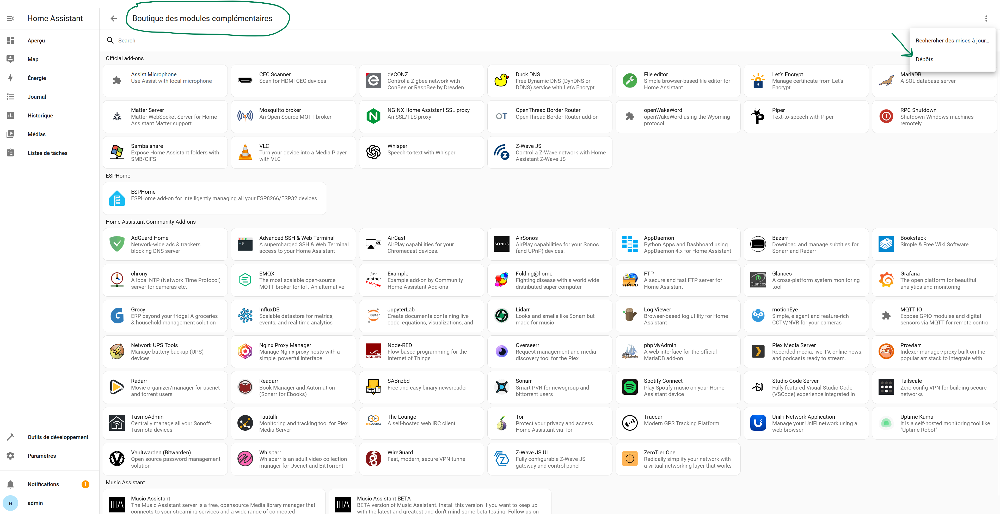

# Portfolio Crypto

## Introduction

L'intégration "Portfolio Crypto" permet de gérer et surveiller vos investissements en cryptomonnaie directement depuis Home Assistant. Cette intégration utilise l'API CoinGecko pour récupérer les informations sur les cryptomonnaies et fournit une interface simple pour suivre vos investissements.

## Fonctionnalités

- **Gestion des Portfolios** : Suivez plusieurs portfolios de cryptomonnaies.
- **Ajout/Suppression de Cryptomonnaies** : Ajoutez ou supprimez des cryptomonnaies de votre portfolio.
- **Suivi des Transactions** : Enregistrez et suivez vos transactions d'achat et de vente.
- **Calcul des Profits et Pertes** : Calculez automatiquement vos profits et pertes pour chaque cryptomonnaie.
- **Icônes Personnalisées** : Affichez des icônes uniformes pour toutes les cryptomonnaies.

## Installation

### Pré-requis

- Home Assistant installé et configuré
- Accès à l'interface de Home Assistant

### Étapes d'installation

1. Accédez à votre interface Home Assistant.
2. Cliquez sur `Paramètres` dans le menu de gauche.
3. Sélectionnez `Modules complémentaires` puis cliquez sur `Boutique des modules complémentaires` et cliquez sur l'icone avec les 3 point en haut à droite, puis cliquez sur Dépots.
   
4. Recherchez `Portfolio Crypto` et cliquez sur `Installer`.
   

3. **Ajouter la Configuration au Fichier `configuration.yaml`** :

    Ajoutez la configuration suivante pour le panneau personnalisé :

    ```yaml
    panel_custom:
      - name: crypto-transactions-panel
        sidebar_title: 'Transactions Crypto'
        sidebar_icon: 'mdi:currency-usd'
        js_url: '/local/crypto-transactions-panel.js'
        config:
          entry_id: your_entry_id
          entry_name: your_entry_name
    ```

4. **Redémarrer Home Assistant** :

    Redémarrez votre instance Home Assistant pour appliquer les modifications.

## Configuration

### Ajouter une Nouvelle Intégration

1. **Accéder aux Intégrations** :

    Allez dans Configuration > Intégrations.

2. **Ajouter l'Intégration "Portfolio Crypto"** :

    Cliquez sur "Ajouter une intégration" et sélectionnez "Portfolio Crypto".

3. **Suivre les Instructions** :

    Suivez les instructions à l'écran pour configurer l'intégration. Vous devrez fournir un nom pour votre portfolio.

### Ajouter une Cryptomonnaie

1. **Accéder aux Options de l'Intégration** :

    Allez dans Configuration > Intégrations et sélectionnez "Options" pour l'intégration "Portfolio Crypto".

2. **Ajouter une Cryptomonnaie** :

    Entrez le nom ou l'ID de la cryptomonnaie que vous souhaitez ajouter.

3. **Confirmer l'Ajout** :

    Suivez les instructions pour confirmer l'ajout de la cryptomonnaie à votre portfolio.

### Supprimer une Cryptomonnaie

1. **Utiliser le Service Personnalisé** :

    Utilisez le service `portfolio_crypto.delete_crypto` avec l'ID de la cryptomonnaie et l'ID de l'entrée.

    Exemple de YAML pour appeler le service :

    ```yaml
    service: portfolio_crypto.delete_crypto
    data:
      entry_id: your_entry_id
      crypto_id: bitcoin
    ```

## Utilisation

### Suivi des Transactions

L'intégration "Portfolio Crypto" permet de suivre toutes vos transactions d'achat et de vente pour chaque cryptomonnaie.

- **Ajouter une Transaction** :

    Utilisez le panneau personnalisé pour ajouter une nouvelle transaction. Vous devrez fournir les informations suivantes :
    - ID de la cryptomonnaie
    - Nom de la cryptomonnaie
    - Quantité
    - Prix (USD)
    - Type de transaction (achat ou vente)
    - Lieu
    - Date

- **Modifier une Transaction** :

    Sélectionnez une transaction existante et modifiez les informations selon vos besoins.

- **Supprimer une Transaction** :

    Supprimez une transaction en utilisant le panneau personnalisé.

### Calcul des Profits et Pertes

L'intégration calcule automatiquement vos profits et pertes basés sur les transactions enregistrées. Les informations suivantes sont disponibles :
- Investissement Total
- Valeur Actuelle
- Profit/Perte Total
- Pourcentage de Profit/Perte

## Personnalisation

### Icônes

Tous les appareils afficheront l'icône "mdi:currency-usd-circle". Si vous souhaitez utiliser une autre icône, vous pouvez modifier la méthode `icon` dans le fichier `sensor.py` :

```python
@property
def icon(self):
    return "mdi:currency-usd-circle"  # Icône globale pour tous les appareils
Ajouter de Nouvelles Icônes
Pour ajouter une icône spécifique à une cryptomonnaie, vous pouvez personnaliser cette méthode selon vos besoins :

python
Copier le code
@property
def icon(self):
    if self._crypto['name'].lower() == "bitcoin":
        return "mdi:currency-btc"
    elif self._crypto['name'].lower() == "ethereum":
        return "mdi:ethereum"
    else:
        return "mdi:currency-usd-circle"
Dépannage
Problèmes de Connexion
Si vous rencontrez des problèmes de connexion avec l'API CoinGecko, assurez-vous que votre instance Home Assistant a accès à Internet et que toutes les dépendances sont correctement installées.

Erreurs de Base de Données
Si vous rencontrez des erreurs liées à la base de données, vérifiez les logs de Home Assistant et assurez-vous que les bases de données sont correctement initialisées et accessibles.

Contribution
Les contributions sont les bienvenues ! Si vous souhaitez contribuer à ce projet, veuillez suivre ces étapes :

Forker le Dépôt :

Forkez le dépôt sur GitHub.

Créer une Branche :

Créez une branche pour votre fonctionnalité ou correction de bug.

Soumettre une Pull Request :

Soumettez une pull request avec une description détaillée de vos modifications.

Licence
Ce projet est sous licence MIT. Voir le fichier LICENSE pour plus de détails.

Merci d'utiliser "Portfolio Crypto" pour Home Assistant. Nous espérons que cette intégration vous aidera à mieux gérer et suivre vos investissements en cryptomonnaie.